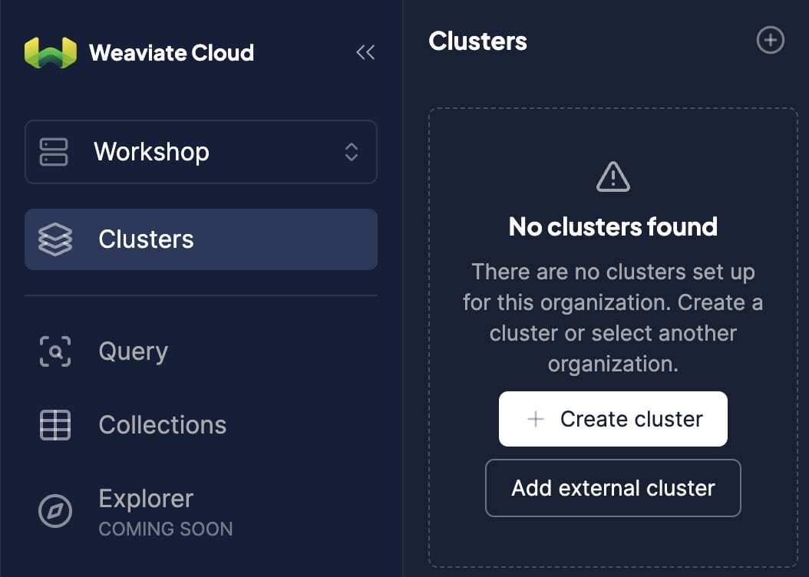
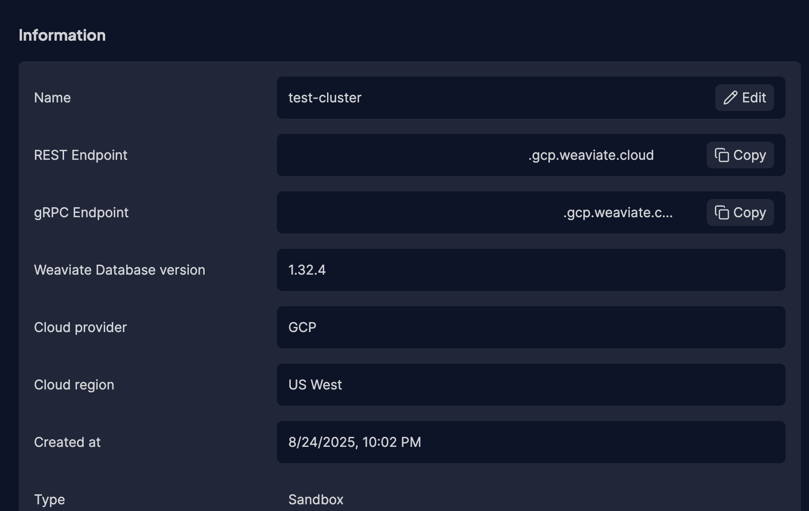
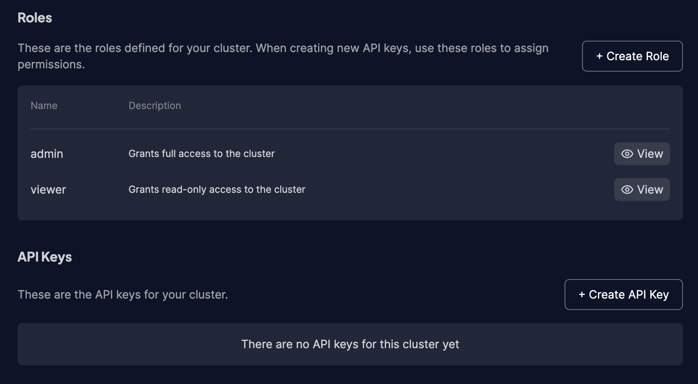
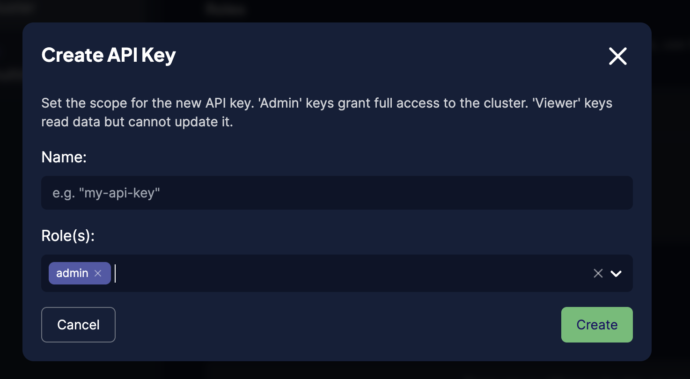

# Building AI Agents with Vector Databases

*Data Science Dojo Agentic AI Conference*

## Create a Weaviate Cloud instance

  * Head to [Weaviate Cloud console](https://console.weaviate.cloud/) and log in, or create a new account.
  * Create a free `Sandbox` cluster. Give it a name, select the cloud region and press "Create".
  * Copy your REST endpointe and paste it into your .env as WEAVIATE_URL
  * Create an API key with admin privileges and copy and paste it into your .env as WEAVIATE _KEY

## Env vars

Update env vars in .env.

Hint. you can find your Weaviate Cluster URL and API keys in the [WCD console](https://console.weaviate.cloud/).

* WEAVIATE_URL= is the `REST Endpoint`
* WEAVIATE_KEY= is the `Admin` key in `API Key`
* OPENAI_API_KEY= is your `OpenAI API Key`

